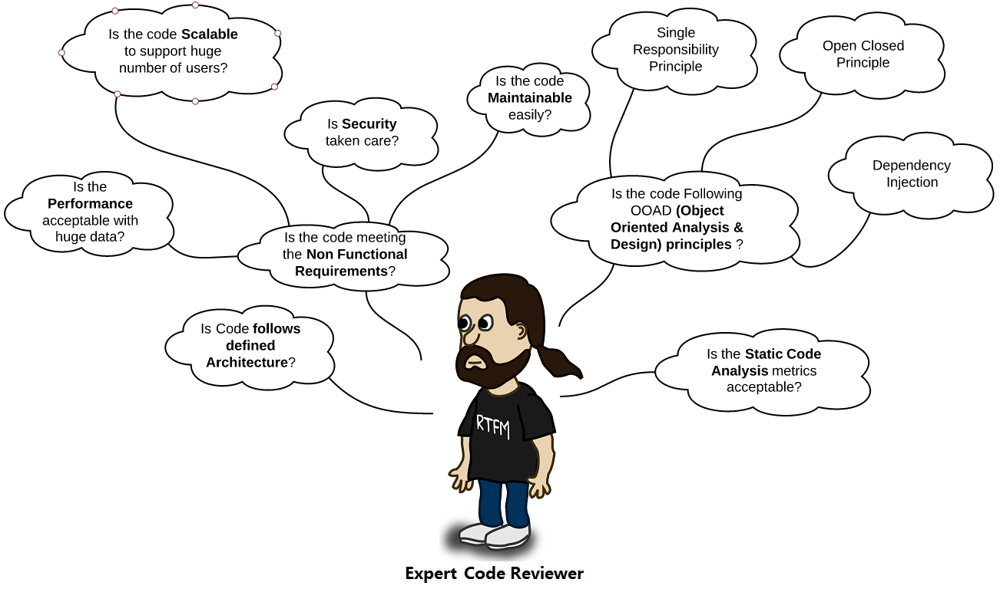

# Code Review Guidelines
## Introduction
Software code review is a process to ensure that the code meets the functional requirements and also helps the developers to adhere to the best coding practices. Additionally, code review process helps in improving the software quality.

## Basic Code Review Checklist

While reviewing the code, ask yourself the following basic questions:

- Am I able to **understand** the code easily?
- Is the code written following the **coding standards/guidelines**?
- Is the same code **duplicated** more than twice?
- Can I **unit test / debug** the code easily to find the root cause?
- Is this function or class **too big**? If yes, is the function or class having too many responsibilities?

If you feel that the answer is not satisfactory to any of the above questions, then you can suggest/recommend code changes.

## Detailed Code Review Checklist
The following code review checklist gives an idea about the various aspects you need to consider while reviewing the code:

### 1. Code formatting
While going through the code, check the code formatting to improve readability and ensure that there are no blockers:

- Use alignments (left margin), proper white space. Also ensure that code block starting point and ending point are easily identifiable.

- Ensure that proper naming conventions (Pascal, CamelCase etc.) have been followed.

- Code should fit in the standard 14 inch laptop screen.  There shouldn’t be a need to scroll horizontally to view the code. In a 21 inch monitor, other windows (toolbox, properties etc.) can be opened while modifying code, so always write code keeping in view a 14 inch monitor.

- Remove the commented code as this is always a blocker, while going through the code. Commented code can be obtained from Source Control (like SVN), if required.

### 2. Architecture
The code should follow the defined architecture.

- Separation of Concerns followed
  - Split into multiple layers and tiers as per requirements (Presentation, Business and Data layers).
  - Split into respective files (HTML, JavaScript and CSS).
- Code is in sync with existing code patterns/technologies.
- Design patterns: Use appropriate design pattern (if it helps), after completely understanding the problem and context.

### 3. Coding best practices
- No hard coding, use constants/configuration values. 
- Group similar values under an enumeration (enum). 
- Comments – Do not write comments for what you are doing, instead write comments on why you are doing. Specify about any hacks, workaround and temporary fixes. Additionally, mention pending tasks in your to-do comments, which can be tracked easily. 
- Avoid multiple if/else blocks. 
- Use framework features, wherever possible instead of writing custom code.

### 4. Non Functional requirements
- **Maintainability (Supportability)** – The application should require the least amount of effort to support in near future. It should be easy to identify and fix a defect.
  - **Readability:** Code should be self-explanatory. Get a feel of story reading, while going through the code. Use appropriate name for variables, functions and classes. If you are taking more time to understand the code, then either code needs refactoring or at least comments have to be written to make it clear. 
  - **Testability:** The code should be easy to test. Refactor into a separate function (if required). Use interfaces while talking to other layers, as interfaces can be mocked easily. Try to avoid static functions, singleton classes as these are not easily testable by mocks. 
  - **Debuggability:** Provide support to log the flow of control, parameter data and exception details to find the root cause easily. If you are using Log4Net like component then add support for database logging also, as querying the log table is easy. 
  - **Configurability:** Keep the configurable values in place (XML file, database table) so that no code changes are required, if the data is changed frequently. 
- **Reusability**
  - DRY (Do not Repeat Yourself) principle: The same code should not be repeated more than twice. 
  - Consider reusable services, functions and components. 
  - Consider generic functions and classes.
- **Reliability** – Exception handling and cleanup (dispose) resources.
- **Extensibility** – Easy to add enhancements with minimal changes to the existing code. One component should be easily replaceable by a better component. 
- **Security** – Authentication, authorization, input data validation against security threats such as SQL injections and Cross Site Scripting (XSS), encrypting the sensitive data (passwords, credit card information etc.)
- **Performance**
  - Use a data type that best suits the needs such as StringBuilder, generic collection classes. 
  - Lazy loading, asynchronous and parallel processing. 
  - Caching and session/application data. 
- **Scalability** – Consider if it supports a large user base/data? Can this be deployed into web farms? 
- **Usability** – Put yourself in the shoes of a end-user and ascertain, if the user interface/API is easy to understand and use. If you are not convinced with the user interface design, then start discussing your ideas with the business analyst.

### 5. Object-Oriented Analysis and Design (OOAD) Principles
- **Single Responsibility Principle (SRS):** Do not place more than one responsibility into a single class or function, refactor into separate classes and functions. 
- **Open Closed Principle:** While adding new functionality, existing code should not be modified. New functionality should be written in new classes and functions. 
- **Liskov substitutability principle:** The child class should not change the behavior (meaning) of the parent class. The child class can be used as a substitute for a base class. 
- **Interface segregation:** Do not create lengthy interfaces, instead split them into smaller interfaces based on the functionality. The interface should not contain any dependencies (parameters), which are not required for the expected functionality. 
- **Dependency Injection:** Do not hardcode the dependencies, instead inject them.
   In most cases the principles are interrelated, following one principle automatically satisfies other principles. For e.g: if the ‘Single Responsibility Principle’ is followed, then Reusability and Testability will automatically increase.

In a few cases, one requirement may contradict with other requirement. So need to trade-off based on the importance of the weight-age, e.g. Performance vs Security. Too many checks and logging at multiple layers (UI, Middle tier, Database) would decrease the performance of an application. But few applications, especially relating to finance and banking require multiple checks, audit logging etc. So it is ok to compromise a little on performance to provide enhanced security.

### Tools for Code Reviews
- The first step while assessing the code quality of the entire project is through a static code analysis tool. Use the tools (based on technology) such as [SonarQube](http://www.sonarqube.org/), [NDepend](http://www.ndepend.com/), [FxCop](https://en.wikipedia.org/wiki/FxCop), TFS code analysis rules. There is a myth that static code analysis tools are only for managers. 
- Use plug-ins such as [Resharper](https://www.jetbrains.com/resharper/), which suggests the best practices in Visual studio. 
- To track the code review comments use the tools like [Crucible](https://www.atlassian.com/software/crucible/overview), [Bitbucket](https://bitbucket.org/) and TFS code review process.

## Code Review Tips

### 1. Highlight issues in the code
Never force software developers to change the code written by them. It may hurt their ego, and they may repeat the same mistake if they do not understand the reason behind code change recommendation. Highlight the issues in the existing code and its consequences.

Here’s an interesting quote on this point:

>“If an egg is broken by outside force, life ends. If broken by inside force, life begins. Great things always begin from inside.” – Jim Kwik, Learning Expert.

### 2. Explain relevant principles
If software developers hesitate to accept given suggestions/recommendations, then explain them relevant principles such as [Separation of Concerns](http://en.wikipedia.org/wiki/Separation_of_concerns), [SRS](http://en.wikipedia.org/wiki/Single_responsibility_principle) (Single Responsibility Principle), [Open-Closed principle](http://en.wikipedia.org/wiki/Open/closed_principle), [Cyclomatic complexity](http://en.wikipedia.org/wiki/Cyclomatic_complexity). If necessary, discuss with them the Non Functional Requirements (NFR) such as Maintainability, Extensibility, Testability and Reliability.

### 3. Discuss relevant quotes
To make the code review process more interesting and engrossing, remind developers relevant quotes/proverbs:

- > “Any stupid can write the program that computer understands but only good programmers write code that humans understand” – Martin Fowler
- >“Measuring programming progress by lines of code is like measuring aircraft building progress by weight.” – Bill Gates
- >“Fat model and thin controller”, “High cohesion and Low coupling”
- >“When debugging, novices insert corrective code; experts remove defective code.” – Richard Pattis

### 4. Do few things offline
Instead of explaining the entire solution to developers during the code review process, simply share the links of relevant websites or encourage them to research on the internet by providing keywords. This action would certainly save the code reviewer’s time and energy. And of course, developers would also like it, since they too need some time to assimilate the proposed solution.

Instead of always sitting next to a developer during the code review process, code reviewers should obtain the code from the source control or shared path, so that it saves developers time. And this would also give code reviewers ample time to recommend the best solution in the context.

### 5. Consider as an Opportunity to learn best practices
Sometimes software developers may take the code reviewer’s comments personally and defend the code without a valid reason. It then becomes the responsibility of a code reviewer to inform the developer to consider this exercise as an opportunity to learn/discuss best practices, but not to identify issues to criticize. Ideally, code reviewers should inform the managers that code review comments should not be used to assess a software developer’s skills. Code review should always be done in a competitive spirit to find more useful comments.

### 6. Always be patient and relook if required
Sometimes, developers do not accept suggestions/recommendation and keep debating. A code reviewer many not know the exact context and challenges, when the code was written. A code reviewer should understand all the points being made by the developer without losing patience. Furthermore, to make the point crystal clear, a code reviewer can explain the points on a paper or on a whiteboard by comparing the developer’s approach vs code reviewer’s approach. Every approach has its pros and cons, need to choose the right approach, whichever weighs more after careful evaluation.

Many times, a third approach evolves which is acceptable to both the developer and the code reviewer. If both of them do not come to a conclusion, then stop the discussion by saying “Let’s discuss this tomorrow, after doing some more analysis”. If the same issue is re-looked on another day with a fresh mindset, it is quite likely that a new approach evolves. Always remember that 
> “No problem can be solved from the same level of consciousness that created it.” – Albert Einstein

### 7. Explain the need for best coding practices
Generally, software developers mention that best coding practices are not followed due to tight project schedules. Developers may feel that it is an acceptable practice. However, code reviewers should educate software developers that as the code size increases or after sometime, the application becomes very difficult to maintain. Moreover, if a client verifies the code then poor quality code may give wrong impression on the team’s/organization’s quality standards. It may also impact awarding new projects or referring an organization to prospective clients.

If the project schedules are too tight then code reviewers should suggest developers to perform [code refactoring](http://en.wikipedia.org/wiki/Code_refactoring) while fixing a defect/adding an enhancement or in next version. While refactoring the code, some functionality may break accidently. Code reviewers should convince the project managers by explaining the importance of code refactoring and the need for allocating additional time to plan this activity.

### 8. Consult second level code reviewer (if not convinced)
If a code reviewer recommends few suggestions, but the developer hesitates to accept these, then discuss it out with the developer. It is quite possible that the code reviewer may not know the entire context. If the developer is still not convinced with the recommendations of the code reviewer, it is perfectly all right to consult a second level code reviewer. However, the developer should ensure that second code reviewer’s suggestions are forwarded to the first code reviewer to ensure that everyone is on the same page.

### 9. Capture the enhancements and technical debt
It is quite likely that some code review suggestions cannot be implemented during current release. However, a code reviewer should ensure that all accepted recommendations are clearly documented in a shared code review document, so that these are implemented at an appropriate time in the future. Additionally, code reviewer should identify and capture all the enhancements from technology and business perspective. Once the project is completed, all captured enhancements can be considered for implementation, instead of searching at that moment. Finding enhancements during code reviews is more efficient than finding separately at the end of the project.

### 10. Document all code review comments
Document all code review comments in an email, word document, excel, or any standard tool used by the organization. Making a mistake for the first time is acceptable, but it is not a good sign to repeat the same mistake. The code review document helps software developers to cross check the highlighted issues and avoid making similar mistakes in the future. Additionally, maintaining a code review document is a mandatory part of the Capability Maturity Model Integration (CMMI) level process.

## References
- https://google.github.io/eng-practices/review/
- https://phauer.com/2018/code-review-guidelines/
- https://www.evoketechnologies.com/blog/code-review-checklist-perform-effective-code-reviews/
- https://www.evoketechnologies.com/blog/simple-effective-code-review-tips/