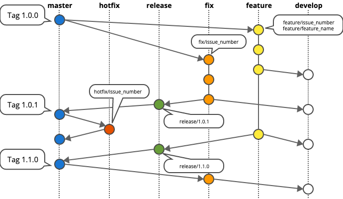

# Git Workflow



## Branching Rules

Branch | Server | Comments
----- | ----- | ----
`master` | Production | Don't commit directly to `master`. Make a PR from `release/x.x.x` to `master`.
`staging` | Staging | Don't commit directly to `staging`. Merge `release/x.x.x` to `staging` and test the changes.
`develop` | Development | Feel free to deploy your `fix`/`feature` to `develop` and test the changes.
`release/x.x.x` | To make a stable release | Use [semantic versioning](https://semver.org/). Create a new release branch from the previous `release/x.x.x` or `master`. Make sure to [tag](https://git-scm.com/book/en/v2/Git-Basics-Tagging) after release.
`fix/issue_number` | To make a fix | Create a new branch from the `master` or latest `release/x.x.x`. Test on `develop` and make PR against upcoming release branch.
`hotfix/issue_number` | To make a hotfix | Create a new branch from the `master`. Follow the project specific git flow to deploy it.
`feature/issue_number` | To work on new feature | Create a new branch from the `master` or latest `release/x.x.x`. Test on `develop` and make PR against upcoming release branch.
`feature/feature_name` | When you have sub issues | Make `feature/feature_name`as the main branch. And create PR against that branch from separate `issue/issue_number` branches.


For more, visit http://nvie.com/posts/a-successful-git-branching-model/

## Easy instruction

- English: https://danielkummer.github.io/git-flow-cheatsheet/index.html
- Japanese: https://danielkummer.github.io/git-flow-cheatsheet/index.ja_JP.html
- Diagram: https://drive.google.com/file/d/1-hPG28qS4k5LLBh-rjCk_itzNv9zW0ys/view


## Overall Steps

- Go to your local project directory `cd YOUR_PROJECT_DIR`
- Checkout to the `master` branch `git checkout master`
- Pull the latest changes from the `master` branch `git pull origin master`
- Create a new branch for the feature you want to implement `git checkout -b feature/your-new-feature`
- Add the changed files to the git `git add .`
- Commit the changes to the git `git commit -m 'Your commit message'`
- Push the commit to the git. [Make sure to specify the branch name otherwise it'll update all branches] `git push origin feature/your-new-feature`
- Checkout to the develop branch `git checkout develop`
- Pull the latest changes from the `develop` branch `git pull origin develop`
- Merge your branch to the `develop` branch `git merge your-new-feature`
- Push the merge commit to the `develop` branch. `git push origin develop`
- Deploy the changes to the `develop` server.
- Check your feature on the `develop` server.
- If everything is alright, open a pull request against the new release branch. If the release isn't available to open against the `master` branch.
- If it's not ok, then checkout again to your branch and do the above steps. Keep in mind, you don't need to recreate your feature branch as it already exists.


## Tips

- Diff everything before apply
- Commit related changes
- Commit often
- Don't commit half done work or merge conflicts
- Test before you commit
- **Write good commit message**
- Try to avoid `git push`, and use `git push origin branch`
- For more, visit  https://www.git-tower.com/learn/git/ebook/en/command-line/appendix/best-practices

## Pull Request template
Please use the following template to make a Pull Request.

```
## Description

Please include a summary of the change and which issue is fixed. List any dependencies that are required for this change.

Fixes # BACKLOG_ISSUE_KEY

## Type of change

- [ ] Bug fix (non-breaking change which fixes an issue)
- [ ] New feature (non-breaking change which adds functionality)
- [ ] Breaking change (fix or feature that would cause existing functionality to not work as expected)

## How Has This Been Tested?

Please describe the tests that you ran to verify your changes. Provide instructions, so we can reproduce. Please also list any relevant details for your test configuration

- [ ] Test A
- [ ] Test B

## Checklist:

- [ ] My code follows the style guidelines of this project
- [ ] I have performed a self-review of my own code
- [ ] I have commented on my code, particularly in hard-to-understand areas
- [ ] I have made corresponding changes to the documentation/README.md/CHANGELOG.md
- [ ] I have checked my code and corrected any misspellings
```


## References

- https://blog.hartleybrody.com/git-small-teams/ (I like this tips)
- https://stackoverflow.com/questions/24582319/branching-and-merging-best-practices-in-git (Here in all answers have some information, but the accepted one could be our summary)
- https://www.git-tower.com/learn/git/ebook/en/command-line/appendix/best-practices (Similar tips but good one)
- https://gist.github.com/pandeiro/1552496 (Informative, what should we do, what should not to do)
- https://docs.gitlab.com/ee/workflow/gitlab_flow.html (May get some ideas)
- https://www.atlassian.com/git/tutorials/comparing-workflows (For details. A very good representation of different workflows)
